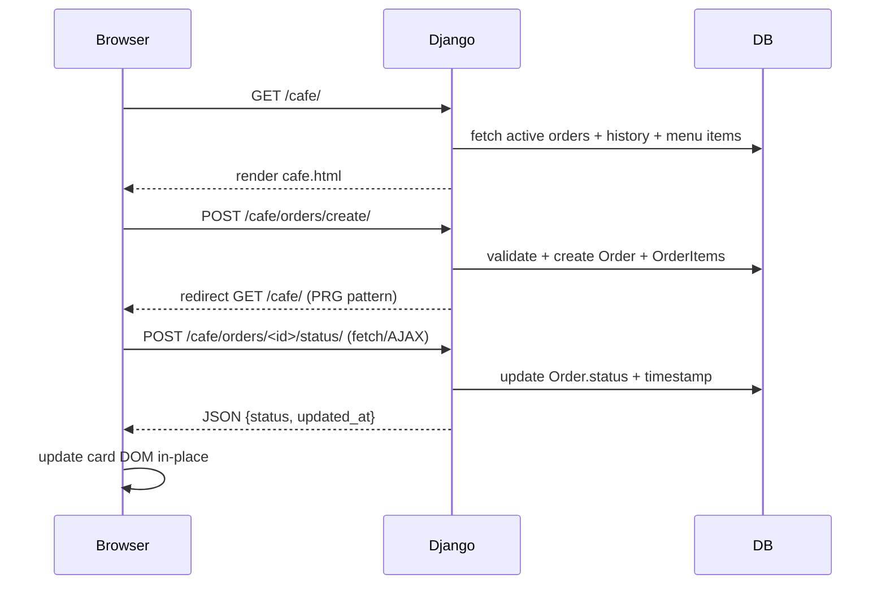
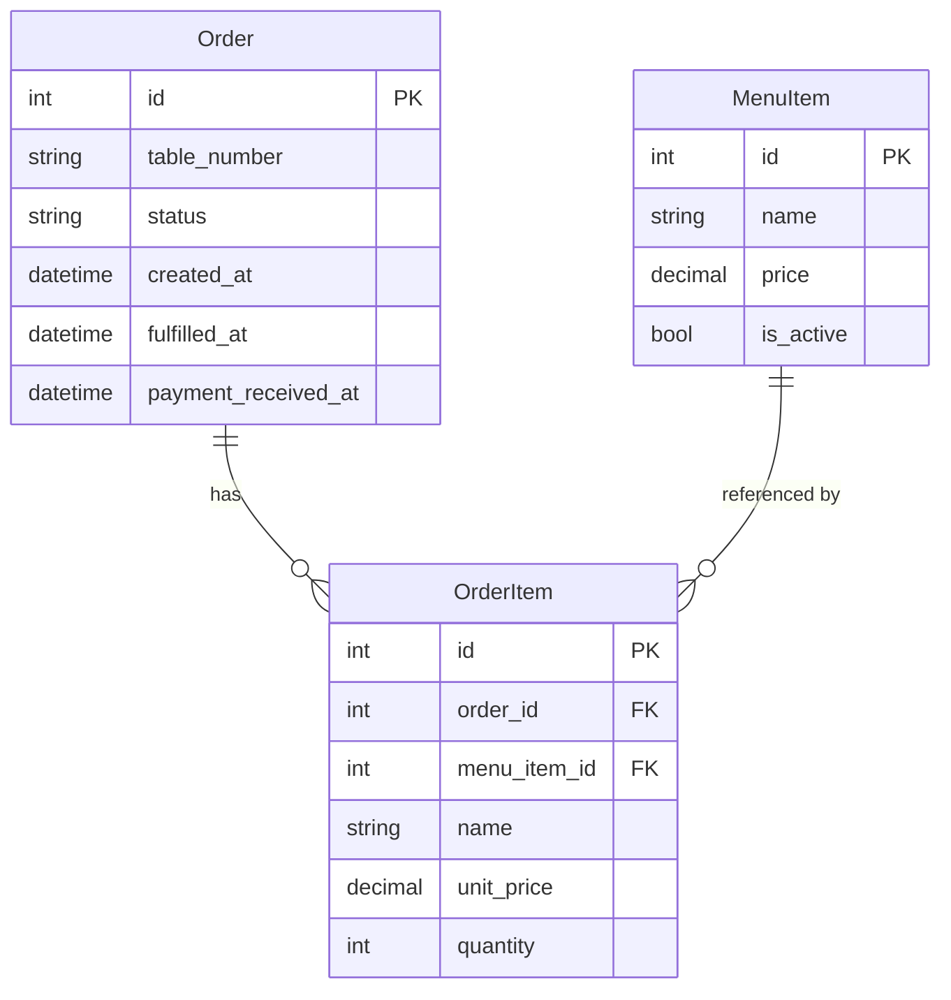

# Design Document — Cafe Management

## Overview

The Cafe Management feature adds a self-contained `cafe` Django app to the existing 5 Star Fitness gym management system. It provides a simple order-entry and tracking workflow for the gym's in-house cafe. A receptionist enters orders (table number + items), advances each order through a two-step lifecycle (`pending → fulfilled → payment_received`), and can review a daily history of completed orders.

The feature is a pure server-side Django application. It reuses the existing SQLite database, Django session/auth stack, and the Spotify-dark Tailwind design system already defined in `templates/base.html`. No new frontend frameworks or build tools are introduced.

### Key Design Decisions

- **Single-page layout**: The main cafe view (`/cafe/`) renders the order-entry form, the active orders board, and the order history section on one page. Status transitions are handled via lightweight AJAX `fetch` calls so the board updates without a full reload (Requirement 3.5).
- **New Django app `cafe`**: Keeps all models, views, URLs, and templates isolated from existing apps, following the project's established pattern.
- **No REST framework**: The project removed `djangorestframework`. Status-update endpoints return JSON directly from plain Django views, consistent with `billing/views.py`'s `MemberPlanInfoView`.
- **Admin-managed menu**: `MenuItem` records are managed through Django admin (Requirement 2.7), avoiding the need for a custom admin UI.

---

## Architecture

```
gymapp/
├── cafe/                        ← new app
│   ├── __init__.py
│   ├── admin.py                 ← registers MenuItem, Order, OrderItem
│   ├── apps.py
│   ├── models.py                ← MenuItem, Order, OrderItem
│   ├── views.py                 ← CafeView, CreateOrderView, UpdateOrderStatusView
│   ├── urls.py
│   └── migrations/
│       └── 0001_initial.py
├── templates/
│   └── cafe/
│       └── cafe.html            ← extends base.html
gymapp/
├── settings.py                  ← add 'cafe' to INSTALLED_APPS
├── urls.py                      ← add path('cafe/', include('cafe.urls'))
templates/
└── base.html                    ← add Cafe sidebar link
```

### Request Flow



---

## Components and Interfaces

### Views

#### `CafeView` (GET `/cafe/`)
- Mixin: `StaffRequiredMixin` (any authenticated user)
- Fetches:
  - `active_orders`: `Order.objects.filter(status__in=['pending','fulfilled']).prefetch_related('items__menu_item').order_by('created_at')`
  - `history_orders`: `Order.objects.filter(status='payment_received', created_at__date=today).prefetch_related('items__menu_item').order_by('-payment_received_at')`
  - `menu_items`: `MenuItem.objects.all().order_by('name')`
- Renders `cafe/cafe.html`

#### `CreateOrderView` (POST `/cafe/orders/create/`)
- Mixin: `StaffRequiredMixin`
- Parses `table_number` and a list of `(item_id_or_name, price, quantity)` tuples from POST data
- Validates: table_number non-empty, at least one item with quantity > 0
- On success: creates `Order` + `OrderItem` records, adds Django success message, redirects to `/cafe/`
- On failure: adds Django error message, redirects to `/cafe/` (form data is re-populated via session flash or query params — see Data Models section)

#### `UpdateOrderStatusView` (POST `/cafe/orders/<id>/status/`)
- Mixin: `StaffRequiredMixin`
- Accepts JSON body `{"action": "fulfill" | "payment_received"}`
- Validates the transition is legal (pending→fulfilled, fulfilled→payment_received)
- Updates `Order.status` and the appropriate timestamp
- Returns `JsonResponse({"ok": true, "status": <new_status>, "badge_html": "..."})`
- On invalid transition: returns `JsonResponse({"ok": false, "error": "..."}, status=400)`

### URL Configuration

```python
# cafe/urls.py
urlpatterns = [
    path('', CafeView.as_view(), name='cafe_home'),
    path('orders/create/', CreateOrderView.as_view(), name='cafe_order_create'),
    path('orders/<int:pk>/status/', UpdateOrderStatusView.as_view(), name='cafe_order_status'),
]
```

Registered in `gymapp/urls.py` as `path('cafe/', include('cafe.urls'))`.

### Template: `cafe/cafe.html`

Extends `base.html`. Three logical sections rendered on one page:

1. **Order Entry Form** — table number input + dynamic item rows (JS-driven add/remove), submit button
2. **Active Orders Board** — card grid of pending/fulfilled orders with status action buttons
3. **Order History** — table of today's completed orders

Status action buttons call `UpdateOrderStatusView` via `fetch()` and update the card DOM on success.

---

## Data Models

### `MenuItem`

```python
class MenuItem(models.Model):
    name  = models.CharField(max_length=200, unique=True)
    price = models.DecimalField(max_digits=8, decimal_places=2)
    is_active = models.BooleanField(default=True)

    class Meta:
        ordering = ['name']

    def __str__(self):
        return f"{self.name} (₹{self.price})"
```

`is_active` allows admins to retire items without deleting historical `OrderItem` records.

### `Order`

```python
class Order(models.Model):
    STATUS_CHOICES = [
        ('pending',          'Pending'),
        ('fulfilled',        'Fulfilled'),
        ('payment_received', 'Payment Received'),
    ]

    table_number         = models.CharField(max_length=20)
    status               = models.CharField(max_length=20, choices=STATUS_CHOICES, default='pending')
    created_at           = models.DateTimeField(auto_now_add=True)
    fulfilled_at         = models.DateTimeField(null=True, blank=True)
    payment_received_at  = models.DateTimeField(null=True, blank=True)

    class Meta:
        ordering = ['created_at']

    def __str__(self):
        return f"Order #{self.pk} — Table {self.table_number} ({self.status})"

    @property
    def total(self):
        return sum(item.subtotal for item in self.items.all())
```

### `OrderItem`

```python
class OrderItem(models.Model):
    order     = models.ForeignKey(Order, on_delete=models.CASCADE, related_name='items')
    menu_item = models.ForeignKey(MenuItem, on_delete=models.SET_NULL, null=True, blank=True)
    name      = models.CharField(max_length=200)   # snapshot / custom item name
    unit_price = models.DecimalField(max_digits=8, decimal_places=2)
    quantity  = models.PositiveIntegerField(default=1)

    def __str__(self):
        return f"{self.quantity}× {self.name}"

    @property
    def subtotal(self):
        return self.unit_price * self.quantity
```

`name` is always stored as a snapshot so historical records remain accurate even if a `MenuItem` is later renamed or deleted. `menu_item` FK is nullable to support custom items.

### Entity Relationship



### Status Transition Machine

```
pending ──► fulfilled ──► payment_received
```

Only forward transitions are valid. Any other transition returns HTTP 400.

---

## Correctness Properties

*A property is a characteristic or behavior that should hold true across all valid executions of a system — essentially, a formal statement about what the system should do. Properties serve as the bridge between human-readable specifications and machine-verifiable correctness guarantees.*

### Property 1: Order creation adds to active board

*For any* valid table number and non-empty list of order items (each with quantity > 0), submitting the order entry form SHALL result in the new order appearing in the active orders board with status `pending`.

**Validates: Requirements 1.6, 3.1**

### Property 2: Empty table number is rejected

*For any* order submission where the table number field is empty or whitespace-only, the system SHALL reject the submission and leave the order count unchanged.

**Validates: Requirements 1.2, 1.4**

### Property 3: Empty item list is rejected

*For any* order submission that contains no items with quantity > 0, the system SHALL reject the submission and leave the order count unchanged.

**Validates: Requirements 1.3, 1.5**

### Property 4: Status transition — pending to fulfilled

*For any* order in `pending` status, invoking the "Mark Fulfilled" action SHALL update the order's status to `fulfilled` and record a non-null `fulfilled_at` timestamp, while leaving all other order fields unchanged.

**Validates: Requirements 4.2**

### Property 5: Status transition — fulfilled to payment_received

*For any* order in `fulfilled` status, invoking the "Mark Payment Received" action SHALL update the order's status to `payment_received` and record a non-null `payment_received_at` timestamp, while leaving all other order fields unchanged.

**Validates: Requirements 5.2**

### Property 6: Invalid status transitions are rejected

*For any* order, attempting a status transition that is not in the valid sequence (`pending → fulfilled → payment_received`) SHALL return an error response and leave the order's status unchanged.

**Validates: Requirements 4.4, 5.5**

### Property 7: Payment-received orders leave the active board

*For any* order whose status is updated to `payment_received`, that order SHALL NOT appear in the active orders query (status `pending` or `fulfilled`).

**Validates: Requirements 5.3**

### Property 8: Payment-received orders appear in today's history

*For any* order whose status is updated to `payment_received` on the current calendar day, that order SHALL appear in the order history query scoped to today.

**Validates: Requirements 5.4, 6.1**

### Property 9: Order item subtotal calculation

*For any* order item with a given unit price and quantity, the computed subtotal SHALL equal `unit_price × quantity`.

**Validates: Requirements 2.4**

### Property 10: Active orders sort order

*For any* set of active orders, the list returned by the active orders query SHALL be sorted by `created_at` in ascending order (oldest first).

**Validates: Requirements 3.3**

### Property 11: History sort order

*For any* set of completed orders for the current day, the list returned by the history query SHALL be sorted by `payment_received_at` in descending order (most recent first).

**Validates: Requirements 6.3**

---

## Error Handling

| Scenario | Handling |
|---|---|
| Table number empty on submit | Django messages error toast; redirect back to `/cafe/` |
| No items on submit | Django messages error toast; redirect back to `/cafe/` |
| Invalid status transition (AJAX) | `JsonResponse({"ok": false, "error": "..."}, status=400)`; JS shows toast |
| Order not found (AJAX) | `get_object_or_404` → 404 response |
| Unauthenticated access | `StaffRequiredMixin` redirects to `/accounts/login/` |
| DB integrity error on create | Wrapped in `try/except`, error message shown |

All user-facing errors use the existing Django messages framework so they appear as the same toast notifications used throughout the application.

---

## Testing Strategy

### Unit Tests (`cafe/tests.py`)

**Model tests** (example-based):
- `MenuItem.__str__` returns expected string
- `OrderItem.subtotal` returns `unit_price × quantity`
- `Order.total` sums all item subtotals correctly
- Creating an `Order` defaults to `pending` status

**View tests** (example-based, using Django `TestClient`):
- `GET /cafe/` returns 200 for authenticated user
- `GET /cafe/` redirects to login for unauthenticated user
- `POST /cafe/orders/create/` with valid data creates an `Order` and redirects
- `POST /cafe/orders/create/` with empty table number does not create an order
- `POST /cafe/orders/create/` with no items does not create an order
- `POST /cafe/orders/<id>/status/` with `fulfill` on a pending order returns 200 and updates status
- `POST /cafe/orders/<id>/status/` with `payment_received` on a fulfilled order returns 200 and updates status
- `POST /cafe/orders/<id>/status/` with invalid transition returns 400

### Property-Based Tests

Using **Hypothesis** (already available in the Python ecosystem; add `hypothesis` to `requirements.txt`).

Each property test runs a minimum of 100 iterations.

```python
# Feature: cafe-management, Property 1: Order creation adds to active board
# Feature: cafe-management, Property 2: Empty table number is rejected
# Feature: cafe-management, Property 3: Empty item list is rejected
# Feature: cafe-management, Property 4: Status transition — pending to fulfilled
# Feature: cafe-management, Property 5: Status transition — fulfilled to payment_received
# Feature: cafe-management, Property 6: Invalid status transitions are rejected
# Feature: cafe-management, Property 7: Payment-received orders leave the active board
# Feature: cafe-management, Property 8: Payment-received orders appear in today's history
# Feature: cafe-management, Property 9: Order item subtotal calculation
# Feature: cafe-management, Property 10: Active orders sort order
# Feature: cafe-management, Property 11: History sort order
```

**Generators**:
- `st.text(min_size=1)` for valid table numbers
- `st.text(max_size=0) | st.text(alphabet=st.characters(whitelist_categories=('Zs',)))` for invalid (empty/whitespace) table numbers
- `st.lists(st.builds(OrderItem, ...), min_size=1)` for valid item lists
- `st.decimals(min_value=Decimal('0.01'), max_value=Decimal('9999.99'))` for prices
- `st.integers(min_value=1, max_value=99)` for quantities

**Property 9** (subtotal) is a pure function test — no database required.

**Properties 1–8, 10–11** use Django's `TestCase` with `@given` from Hypothesis (Hypothesis supports Django via `hypothesis.extra.django`).

### Integration / Smoke Tests

- Verify `cafe` app migrations apply cleanly: `python manage.py migrate --check`
- Verify Django admin registers `MenuItem`, `Order`, `OrderItem` without errors
- Verify sidebar link renders correctly in `base.html` for authenticated users
