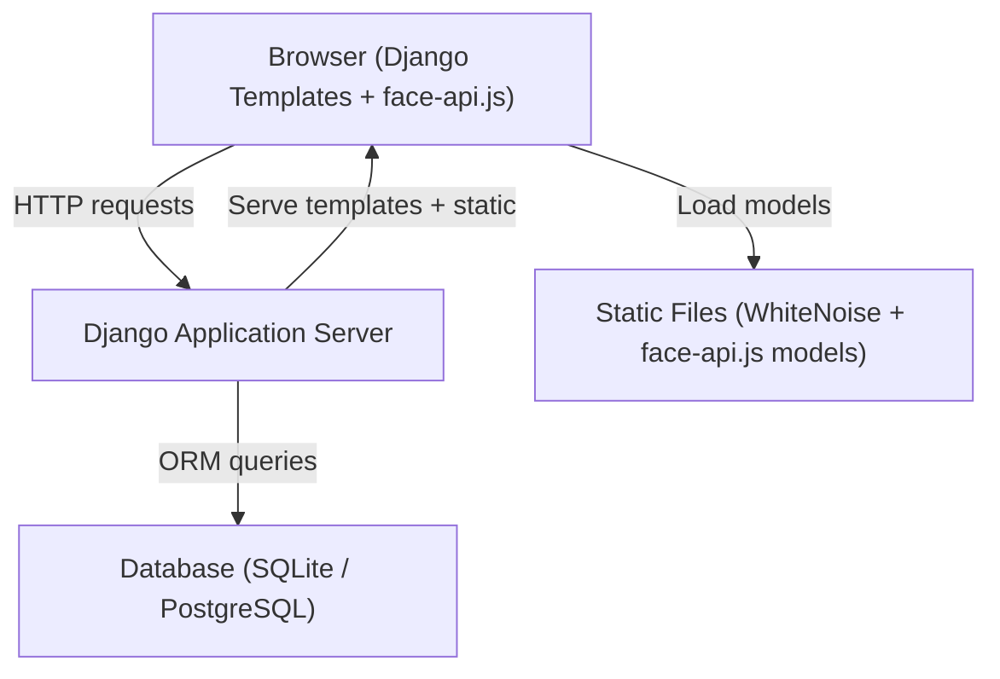
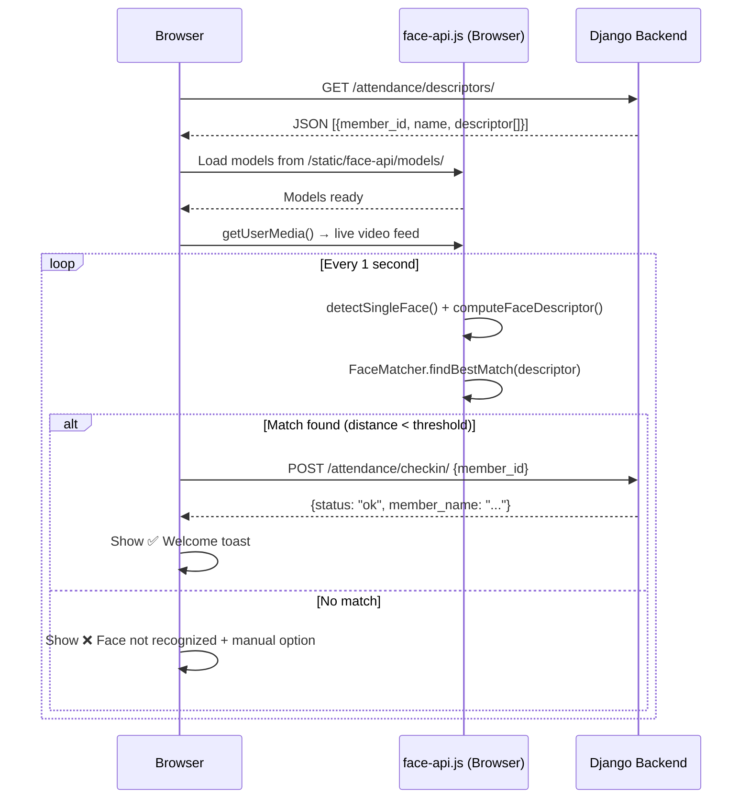

# Design Document: Gym Management Web Application

## Overview

A Django-based gym management system with server-rendered templates, Tailwind CSS, and browser-side facial recognition via face-api.js. The application is organized into four Django apps: `accounts`, `members`, `billing`, and `attendance`. Facial recognition runs entirely in the browser — face descriptors are stored in the database and loaded into the browser for matching. The backend only receives the result of a match (a member ID) and records the attendance event.

---

## Architecture



### Request Flow — Facial Recognition Attendance



---

## Components and Interfaces

### Django Apps

#### `accounts` app
- Extends Django's built-in auth with a `Profile` model to store the user's role.
- Provides login/logout views using Django's `AuthenticationForm`.
- Custom middleware or mixins enforce role-based access.

#### `members` app
- `Member` model and CRUD views.
- Registration view includes webcam capture UI (face-api.js).
- API endpoint: `GET /members/descriptors/` — returns all member IDs, names, and face descriptors for browser-side matching.

#### `billing` app
- `MembershipPlan` and `Payment` models.
- Payment creation view auto-updates member `expiry_date` and `status`.
- Overdue member detection via a queryset filter.

#### `attendance` app
- `Attendance` model.
- `POST /attendance/checkin/` — receives `member_id`, validates no duplicate for today, creates record.
- `GET /attendance/` — list view with CSV export.

### URL Structure

```
/                          → redirect to dashboard
/accounts/login/           → login page
/accounts/logout/          → logout
/dashboard/                → dashboard (Admin + Staff)
/members/                  → member list
/members/add/              → member registration (with face capture)
/members/<id>/             → member detail
/members/<id>/edit/        → edit member
/members/<id>/delete/      → delete member
/members/descriptors/      → API: all face descriptors (JSON)
/billing/plans/            → membership plan list/create
/billing/plans/<id>/edit/  → edit plan
/billing/payments/         → payment list
/billing/payments/add/     → record payment
/attendance/               → attendance list + face recognition UI
/attendance/checkin/       → API: POST check-in
/attendance/export/        → CSV export
```

### Role Permission Matrix

| Feature                  | Admin | Staff |
|--------------------------|-------|-------|
| Dashboard                | ✅    | ✅    |
| Member list/detail       | ✅    | ✅    |
| Member add/edit/delete   | ✅    | ✅    |
| Billing / Payments       | ✅    | ❌    |
| Membership Plans         | ✅    | ❌    |
| Attendance (face + manual)| ✅   | ✅    |
| CSV Export               | ✅    | ❌    |
| User management          | ✅    | ❌    |

---

## Data Models

### `accounts.Profile`
```python
class Profile(models.Model):
    user = models.OneToOneField(User, on_delete=models.CASCADE)
    role = models.CharField(max_length=10, choices=[('admin', 'Admin'), ('staff', 'Staff')])
```

### `members.MembershipPlan`
```python
class MembershipPlan(models.Model):
    name = models.CharField(max_length=100)
    price = models.DecimalField(max_digits=8, decimal_places=2)
    duration_days = models.PositiveIntegerField()
```

### `members.Member`
```python
class Member(models.Model):
    STATUS_CHOICES = [('active', 'Active'), ('expired', 'Expired'), ('suspended', 'Suspended')]

    full_name = models.CharField(max_length=200)
    phone = models.CharField(max_length=20)
    email = models.EmailField(unique=True)
    photo = models.ImageField(upload_to='member_photos/')
    face_descriptor = models.JSONField()          # 128-float list
    join_date = models.DateField()
    membership_plan = models.ForeignKey(MembershipPlan, on_delete=models.PROTECT)
    expiry_date = models.DateField()
    status = models.CharField(max_length=10, choices=STATUS_CHOICES, default='active')
```

### `billing.Payment`
```python
class Payment(models.Model):
    PAYMENT_METHODS = [('cash', 'Cash'), ('card', 'Card'), ('transfer', 'Transfer')]

    member = models.ForeignKey(Member, on_delete=models.CASCADE, related_name='payments')
    amount = models.DecimalField(max_digits=8, decimal_places=2)
    date_paid = models.DateField()
    period_start = models.DateField()
    period_end = models.DateField()
    payment_method = models.CharField(max_length=20, choices=PAYMENT_METHODS)
    notes = models.TextField(blank=True)
```

### `attendance.Attendance`
```python
class Attendance(models.Model):
    METHOD_CHOICES = [('face', 'Face'), ('manual', 'Manual')]

    member = models.ForeignKey(Member, on_delete=models.CASCADE, related_name='attendances')
    check_in_time = models.TimeField(auto_now_add=True)
    date = models.DateField(auto_now_add=True)
    method = models.CharField(max_length=10, choices=METHOD_CHOICES)

    class Meta:
        unique_together = ('member', 'date')   # one check-in per member per day
```

---

## Correctness Properties

*A property is a characteristic or behavior that should hold true across all valid executions of a system — essentially, a formal statement about what the system should do. Properties serve as the bridge between human-readable specifications and machine-verifiable correctness guarantees.*

### Property 1: Expiry date derivation invariant
*For any* member registration with a valid `join_date` and a `Membership_Plan` with `duration_days = D`, the stored `expiry_date` should equal `join_date + timedelta(days=D)`.
**Validates: Requirements 2.6**

### Property 2: Payment updates expiry date
*For any* member and any new payment with `period_end = E`, after the payment is recorded the member's `expiry_date` should equal `E`.
**Validates: Requirements 5.2**

### Property 3: Status reflects expiry date
*For any* member, if `expiry_date` is in the future relative to today, `status` should be "Active"; if `expiry_date` is today or in the past, `status` should be "Expired".
**Validates: Requirements 2.7, 5.3**

### Property 4: No duplicate daily check-in
*For any* member and any calendar date, there should be at most one `Attendance` record with that `(member, date)` pair in the database.
**Validates: Requirements 6.8**

### Property 5: Face descriptor round-trip
*For any* member whose `face_descriptor` is stored as a JSON array, serializing then deserializing the descriptor should produce a list of 128 floats equal to the original.
**Validates: Requirements 2.3**

### Property 6: Check-in method integrity
*For any* `Attendance` record, the `method` field should be exactly "face" when created via the `/attendance/checkin/` API endpoint, and exactly "manual" when created via the manual check-in form.
**Validates: Requirements 6.9, 6.10**

### Property 7: Monthly revenue calculation
*For any* set of payments, the dashboard monthly revenue should equal the sum of `amount` for all payments where `date_paid` falls within the current calendar month.
**Validates: Requirements 5.6**

### Property 8: Overdue member detection
*For any* member, if `expiry_date < today`, the member should appear in the overdue members list and not appear in the active members list.
**Validates: Requirements 5.5**

### Property 9: Descriptor cache completeness
*For any* call to `GET /members/descriptors/`, the response should contain exactly one entry per member who has a non-null `face_descriptor`, with no duplicates.
**Validates: Requirements 6.1**

### Property 10: CSV export completeness
*For any* date range filter `[start, end]` applied to the CSV export, every `Attendance` record with `date` in `[start, end]` should appear in the exported file, and no record outside that range should appear.
**Validates: Requirements 8.5, 8.6**

---

## Error Handling

| Scenario | Handling |
|---|---|
| Model load failure (face-api.js) | Show error banner, disable webcam UI, offer manual check-in |
| No face detected during registration | Block form submission, show inline error |
| Duplicate check-in (same day) | Backend returns 409, browser shows toast "Already checked in today" |
| Camera permission denied | Show instructions to enable camera permissions |
| Network error on check-in POST | Show retry button, log error to console |
| Invalid member ID in check-in POST | Backend returns 404, browser shows error toast |
| Membership plan deletion with active members | Return 400 with warning message, do not delete |
| Unauthenticated access | Redirect to `/accounts/login/?next=<url>` |
| Staff accessing admin-only page | Return 403, render permission denied template |

---

## Testing Strategy

### Unit Tests
- `expiry_date` calculation on member save (Property 1)
- `expiry_date` update on payment save (Property 2)
- Member `status` derivation logic (Property 3)
- Duplicate check-in rejection at the model/view level (Property 4)
- Monthly revenue aggregation query (Property 7)
- Overdue member queryset filter (Property 8)
- CSV export row count and date range filtering (Property 10)

### Property-Based Tests
Use **Hypothesis** (Python property-based testing library) with a minimum of 100 iterations per property.

Each property test is tagged with:
`# Feature: gym-management, Property N: <property_text>`

- **Property 1**: Generate random `join_date` and `duration_days` values; assert `expiry_date == join_date + timedelta(days=duration_days)`.
- **Property 2**: Generate random payment `period_end` dates; assert member `expiry_date` equals `period_end` after payment save.
- **Property 3**: Generate random `expiry_date` values relative to today; assert `status` is "active" iff `expiry_date > today`.
- **Property 4**: Generate random sequences of check-in attempts for the same member on the same date; assert only one `Attendance` record exists.
- **Property 5**: Generate random 128-float lists; serialize to JSON, deserialize, assert equality.
- **Property 7**: Generate random sets of payments with random `date_paid` values; assert dashboard revenue equals sum of current-month payments.
- **Property 8**: Generate random members with random `expiry_date` values; assert overdue list contains exactly those with `expiry_date < today`.
- **Property 10**: Generate random attendance records and date ranges; assert CSV output contains exactly the records within range.

### Integration Tests
- Full member registration flow (form submit → DB record with descriptor)
- Full attendance check-in flow (POST → Attendance record created)
- Payment recording → member `expiry_date` and `status` updated
- Role-based access: Staff cannot access billing URLs (assert 403)
- CSV export returns valid CSV with correct headers
